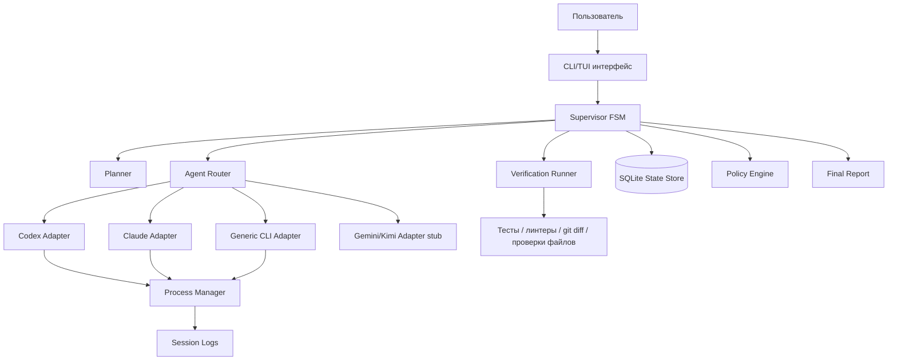

# ТЗ на разработку MVP: оркестратор локальных ИИ-агентов

Версия: 0.1
Дата: 2026-06-25
Рабочее название: **Agent Orchestrator / AI Task Finisher**

---

## 1. Цель проекта

Создать MVP-программу, которая выступает **supervisor-оркестратором** над уже установленными на компьютере ИИ-инструментами: Codex CLI, Claude Code, Gemini CLI, Kimi Code CLI и другими CLI-агентами.

Главная задача MVP — не просто отправить запрос агенту, а **довести задачу до результата** через управляемый цикл:

1. Принять пользовательскую задачу.
2. Сформировать план и Definition of Done.
3. Передать конкретный шаг выбранному ИИ-агенту.
4. Получить результат.
5. Запустить независимые проверки: тесты, линтеры, git diff, наличие файлов, команды верификации.
6. Если результат не готов — сформировать follow-up и продолжить работу.
7. Завершить задачу только после выполнения критериев готовности либо зафиксировать блокер.

---

## 2. Главный архитектурный принцип

MVP строится не как “макрос поверх окон”, а как **control plane над CLI-агентами**.

Приоритет способов интеграции:

1. Нативный headless / non-interactive режим агента.
2. JSON / JSONL / stream output, если поддерживается.
3. Resume / continue существующей сессии.
4. Работа через subprocess / PTY.
5. Интеграция через MCP / ACP — отдельным этапом.
6. GUI / browser / window automation — только fallback, не core-path MVP.

---

## 3. Что входит в MVP

### 3.1. Основной пользовательский сценарий

Пользователь запускает оркестратор из терминала:

```bash
ai-orch start --repo ./my-project --task "Добавить авторизацию по JWT и покрыть тестами"
```

Оркестратор:

1. Создаёт рабочую задачу.
2. Формирует план.
3. Выбирает агента по настройкам.
4. Запускает агента.
5. Передаёт ему первый шаг.
6. Сохраняет весь вывод.
7. Проверяет изменения.
8. Запускает тесты.
9. Если тесты упали — возвращает агенту ошибку и просит исправить.
10. Если тесты прошли и DoD выполнен — завершает задачу.
11. Если агент зациклился, не отвечает или не может решить — ставит статус `blocked`.

---

## 4. MVP-границы

### Входит

- Локальный запуск на компьютере пользователя.
- CLI/TUI-интерфейс.
- Поддержка минимум одного полноценного агента на старте: **Codex CLI или Claude Code**.
- Универсальный `GenericCLIAdapter` для любых CLI-команд.
- Хранение состояния задачи в SQLite.
- Логирование всех итераций.
- Проверка результата через shell-команды.
- Возможность продолжить задачу после перезапуска оркестратора.
- Ручное подтверждение опасных действий.
- Конфигурация через YAML.

### Не входит в MVP

- Полноценная RPA-автоматизация любых открытых окон.
- Управление браузерными чатами через координаты мыши.
- Облачный multi-user режим.
- Собственная LLM-модель.
- Полная замена Codex / Claude / Gemini / Kimi.
- Автоматический git push без подтверждения.
- Автоматическое удаление файлов вне рабочей директории.
- Выполнение произвольных команд без policy-проверки.
- Полная поддержка MCP/ACP в первой версии, если это замедляет MVP.

---

## 5. Целевая архитектура MVP



---

## 6. Основные компоненты

### 6.1. CLI/TUI интерфейс

На MVP достаточно CLI с простым TUI-режимом.

Команды:

```bash
ai-orch init
ai-orch agents
ai-orch start --task "..." --repo ./repo
ai-orch status <task_id>
ai-orch logs <task_id>
ai-orch resume <task_id>
ai-orch stop <task_id>
ai-orch report <task_id>
```

Опционально:

```bash
ai-orch tui
```

TUI показывает:

- список задач;
- текущий статус;
- активного агента;
- план;
- последнюю итерацию;
- результаты проверок;
- действия, ожидающие подтверждения.

---

### 6.2. Supervisor FSM

Supervisor — главный управляющий цикл.

Состояния:

| Состояние | Описание |
|---|---|
| `created` | задача создана |
| `planning` | формируется план и DoD |
| `dispatching` | выбирается агент и следующий шаг |
| `running_agent` | агент выполняет поручение |
| `collecting_result` | собирается вывод, diff, артефакты |
| `verifying` | запускаются проверки |
| `deciding` | принимается решение: продолжить / завершить / заблокировать |
| `waiting_approval` | требуется подтверждение пользователя |
| `done` | задача завершена |
| `blocked` | задача заблокирована |
| `failed` | системная ошибка |

Цикл:

```text
PLAN -> DISPATCH -> RUN -> COLLECT -> VERIFY -> DECIDE
                                      ^              |
                                      |              |
                                      +--- CONTINUE -+
```

---

### 6.3. Planner

Planner формирует:

- краткое описание задачи;
- список подзадач;
- Definition of Done;
- список проверок;
- предполагаемого агента;
- ограничения;
- риски.

На MVP planner может быть реализован двумя способами:

1. Простая rule-based логика + шаблонный prompt.
2. Запрос к выбранному агенту: Codex/Claude/Kimi/Gemini.

Пример результата planner:

```yaml
task:
  title: "JWT авторизация"
  repository: "./my-project"
definition_of_done:
  - "Добавлен middleware проверки JWT"
  - "Добавлены unit-тесты"
  - "Все тесты проходят"
  - "README обновлён"
checks:
  - "pytest"
  - "ruff check ."
  - "git diff --check"
```

---

### 6.4. Agent Router

Agent Router выбирает исполнителя.

Правила MVP:

- если задача про код и доступен Codex — использовать Codex;
- если Codex недоступен, но доступен Claude — использовать Claude;
- если нет специализированного адаптера — использовать Generic CLI;
- если агент завис / не справился N раз — можно переключить агента.

Поля выбора:

```yaml
agent_selection:
  default_agent: codex
  fallback_agents:
    - claude
    - generic
  max_failures_before_switch: 2
```

---

### 6.5. Agent Adapter Interface

Все агенты подключаются через единый интерфейс:

```python
class AgentAdapter:
    name: str

    def check_available(self) -> bool:
        ...

    def start_session(self, task_context: TaskContext) -> SessionRef:
        ...

    def run_step(self, session: SessionRef, prompt: str) -> AgentResult:
        ...

    def continue_session(self, session: SessionRef, prompt: str) -> AgentResult:
        ...

    def stop_session(self, session: SessionRef) -> None:
        ...

    def get_status(self, session: SessionRef) -> AgentStatus:
        ...
```

`AgentResult`:

```yaml
agent_result:
  status: success | failed | timeout | needs_approval | blocked
  raw_output: "..."
  structured_output: {}
  files_changed: []
  commands_run: []
  session_id: "..."
  error: null
```

---

## 7. Адаптеры MVP

### 7.1. CodexExecAdapter

Назначение: запускать Codex CLI в headless/non-interactive режиме.

MVP-возможности:

- проверить наличие `codex`;
- запускать задачу через `codex exec`;
- по возможности включать JSON/JSONL output;
- сохранять session id / transcript;
- продолжать сессию через resume, если доступно;
- передавать follow-up prompt после неуспешной проверки.

Пример команды:

```bash
codex exec --json "Выполни следующий шаг..."
```

Важно: точные флаги должны быть вынесены в конфигурацию, потому что CLI-инструменты быстро меняются.

---

### 7.2. ClaudeHeadlessAdapter

Назначение: запускать Claude Code в программном/headless режиме.

MVP-возможности:

- проверить наличие `claude`;
- запускать prompt через `claude -p`;
- использовать JSON/stream JSON, если доступно;
- задавать список разрешённых tools;
- продолжать сессию через continue/resume;
- передавать системный append prompt с правилами оркестратора.

Пример команды:

```bash
claude -p "Выполни следующий шаг..." --output-format json
```

---

### 7.3. GenericCLIAdapter

Назначение: поддержать любой CLI-агент, даже если под него ещё нет специальной интеграции.

Конфигурация:

```yaml
agents:
  generic_kimi:
    type: generic_cli
    command: "kimi"
    args: ["-p", "{prompt}"]
    cwd: "{repo}"
    timeout_sec: 1800
```

Ограничение: generic adapter хуже понимает состояние сессии и структурированный вывод, но позволяет быстро подключить новые агенты.

---

### 7.4. GeminiAdapter / KimiAdapter

Для MVP можно сделать как stub или generic-based адаптер.

Полноценную поддержку отложить на следующий этап:

- MCP-интеграция для Gemini;
- ACP-интеграция для Kimi;
- устойчивое продолжение сессий;
- обработка tool events.

---

## 8. Verification Runner

Verification Runner — ключевая часть MVP. Оркестратор не должен верить фразе агента “всё готово”. Он должен проверять.

Типы проверок:

| Тип | Пример |
|---|---|
| shell command | `pytest`, `npm test`, `mvn test` |
| lint | `ruff check .`, `eslint .` |
| git | `git diff --check`, `git status --short` |
| file exists | `README.md`, `src/auth/jwt.py` |
| content check | наличие строки / паттерна |
| timeout check | команда не должна висеть дольше N секунд |

Пример:

```yaml
verification:
  commands:
    - name: "unit tests"
      run: "pytest"
      timeout_sec: 600
    - name: "lint"
      run: "ruff check ."
      timeout_sec: 300
    - name: "git diff check"
      run: "git diff --check"
      timeout_sec: 60
```

Результат проверки:

```yaml
verification_result:
  status: passed | failed | skipped
  failed_checks:
    - name: "unit tests"
      exit_code: 1
      output_tail: "AssertionError..."
```

---

## 9. Decision Engine

Decision Engine принимает решение после каждой итерации.

Правила MVP:

1. Если все проверки прошли и DoD выполнен — `done`.
2. Если проверки упали — сформировать follow-up prompt с ошибками.
3. Если агент сообщил о блокере — проверить, реальный ли это блокер.
4. Если агент N раз подряд не меняет файлы — `blocked`.
5. Если агент зациклился — `blocked`.
6. Если команда требует опасного действия — `waiting_approval`.
7. Если превышен лимит итераций — `blocked`.

Параметры:

```yaml
limits:
  max_iterations: 10
  max_same_error_retries: 3
  max_no_change_iterations: 2
  max_task_runtime_minutes: 120
```

---

## 10. Follow-up prompt

После неудачной проверки оркестратор сам формирует следующий prompt.

Шаблон:

```text
Ты выполняешь задачу в рамках общего плана.

Исходная задача:
{task}

Definition of Done:
{definition_of_done}

Текущий шаг:
{current_step}

Результат проверки:
{verification_summary}

Ошибки:
{failed_checks}

Что нужно сделать:
1. Проанализируй причину ошибки.
2. Исправь только необходимые файлы.
3. Не меняй несвязанные части проекта.
4. После исправления кратко опиши, что изменено.
5. Не заявляй, что задача готова, пока проверки не пройдут.
```

---

## 11. State Store

Для MVP использовать SQLite.

Сущности:

### tasks

| Поле | Тип |
|---|---|
| id | string |
| title | string |
| repo_path | string |
| original_task | text |
| status | string |
| created_at | datetime |
| updated_at | datetime |
| current_iteration | int |
| max_iterations | int |

### task_plan

| Поле | Тип |
|---|---|
| id | string |
| task_id | string |
| plan_yaml | text |
| definition_of_done | text |
| current_step | int |

### sessions

| Поле | Тип |
|---|---|
| id | string |
| task_id | string |
| agent_name | string |
| external_session_id | string |
| status | string |
| started_at | datetime |
| ended_at | datetime |

### iterations

| Поле | Тип |
|---|---|
| id | string |
| task_id | string |
| session_id | string |
| iteration_no | int |
| prompt | text |
| raw_output | text |
| status | string |
| created_at | datetime |

### verification_runs

| Поле | Тип |
|---|---|
| id | string |
| task_id | string |
| iteration_id | string |
| status | string |
| command | text |
| exit_code | int |
| output | text |
| created_at | datetime |

### approvals

| Поле | Тип |
|---|---|
| id | string |
| task_id | string |
| requested_action | text |
| risk_level | string |
| status | pending / approved / rejected |
| created_at | datetime |

---

## 12. Конфигурация

Файл:

```bash
.ai-orch/config.yaml
```

Пример:

```yaml
project:
  name: "my-project"
  repo: "."

agents:
  codex:
    enabled: true
    type: codex_exec
    command: "codex"
    timeout_sec: 1800

  claude:
    enabled: true
    type: claude_headless
    command: "claude"
    timeout_sec: 1800
    allowed_tools:
      - "Read"
      - "Edit"
      - "Bash"

  generic_kimi:
    enabled: false
    type: generic_cli
    command: "kimi"
    args: ["-p", "{prompt}"]

orchestrator:
  default_agent: codex
  fallback_agents: ["claude"]
  max_iterations: 10
  max_no_change_iterations: 2

verification:
  commands:
    - name: "tests"
      run: "pytest"
      timeout_sec: 600
    - name: "lint"
      run: "ruff check ."
      timeout_sec: 300

policy:
  require_approval:
    - "git push"
    - "rm -rf"
    - "delete outside repo"
    - "network call"
  deny:
    - "format disk"
    - "read ~/.ssh"
    - "read .env outside repo"
```

---

## 13. Безопасность

MVP должен иметь базовые ограничения.

### Обязательные правила

1. По умолчанию агент работает только внутри указанного repo/workspace.
2. Все команды логируются.
3. Опасные команды требуют подтверждения.
4. Запрещено читать секреты вне проекта.
5. Запрещено удалять файлы вне проекта.
6. `git push` только после явного подтверждения.
7. Любые сетевые действия можно отключить политикой.
8. Внешний web/browser input считается недоверенным.
9. Нельзя давать агенту безусловный доступ к localhost control plane.
10. Все зависимости фиксируются lock-файлами.

### Риск, который надо явно учитывать

Главный риск агентных систем — prompt injection и tool abuse: агент может прочитать недоверенный текст, принять его за инструкцию и выполнить опасное действие. Поэтому supervisor должен отделять:

- пользовательскую задачу;
- системные правила;
- вывод агента;
- логи;
- web-страницы;
- результаты тестов.

---

## 14. Логирование и отчётность

После завершения задачи оркестратор формирует отчёт:

```bash
ai-orch report <task_id>
```

Отчёт содержит:

- исходную задачу;
- план;
- выполненные шаги;
- выбранных агентов;
- число итераций;
- изменённые файлы;
- команды проверок;
- результаты тестов;
- нерешённые вопросы;
- финальный статус;
- рекомендации пользователю.

Формат отчёта:

- Markdown;
- JSON для машинной обработки.

---

## 15. Критерии готовности MVP

MVP считается готовым, если:

1. Можно создать задачу из CLI.
2. Оркестратор формирует план и DoD.
3. Оркестратор запускает минимум одного реального CLI-агента.
4. Оркестратор сохраняет вывод агента.
5. Оркестратор запускает проверки после работы агента.
6. Если проверки падают, оркестратор автоматически отправляет follow-up агенту.
7. Если проверки проходят, задача получает статус `done`.
8. Если задача не может быть завершена, статус становится `blocked`, а причина фиксируется.
9. После перезапуска программы можно продолжить задачу.
10. Все итерации и проверки сохраняются в SQLite.
11. Есть конфиг агентов и проверок.
12. Есть минимальный policy engine для опасных команд.
13. Есть финальный markdown-отчёт.

---

## 16. Рекомендуемый стек

### MVP

- Python 3.12+
- Typer или Click для CLI
- Rich для красивого вывода
- Textual для TUI, если нужен интерактивный экран
- SQLite
- Pydantic для схем
- PyYAML или ruamel.yaml для конфигурации
- subprocess / asyncio subprocess
- pexpect для Unix-like PTY
- wexpect / ConPTY-обёртка для Windows при необходимости
- pytest для тестирования самого оркестратора

### На следующих этапах

- LangGraph или Microsoft Agent Framework для более сложного workflow runtime
- MCP SDK для tool-интеграций
- ACP client/server для агентных сессий
- Playwright для browser fallback
- pywinauto / AppleScript / xdotool для GUI fallback
- Docker sandbox для изоляции задач

---

## 17. Что можно переиспользовать из существующих проектов

### OpenHands

Использовать как архитектурный референс:

- control center для coding agents;
- управление агентскими сессиями;
- рабочее пространство;
- terminal/file/task tools;
- идея self-hosted agent workspace.

Не обязательно сразу встраивать OpenHands внутрь MVP. На старте достаточно изучить структуру и взять подходы.

### OpenHands Software Agent SDK

Можно рассмотреть для следующего этапа, если понадобится готовый SDK для software-agent runtime.

### LangGraph

Использовать как референс для:

- state machine;
- durable execution;
- human-in-the-loop;
- long-running workflows.

В MVP можно не тянуть LangGraph как зависимость, а реализовать простую FSM самостоятельно.

### Microsoft Agent Framework

Использовать как референс для production-архитектуры:

- graph workflows;
- restartability;
- observability;
- multi-agent handoff.

### Overmind / tmux control mode

Использовать как референс для process/session manager на Unix-like системах.

### Textual / Rich

Использовать напрямую для CLI/TUI.

### pexpect / pywinauto / Playwright

Использовать как отдельные adapter/fallback слои, не как ядро системы.

---

## 18. Этапы разработки

### Этап 1. Каркас проекта

Результат:

- репозиторий;
- CLI-команды;
- конфигурация;
- SQLite;
- базовые модели;
- логирование.

Задачи:

1. Создать структуру проекта.
2. Настроить Python package.
3. Добавить `ai-orch init`.
4. Добавить чтение `.ai-orch/config.yaml`.
5. Добавить SQLite schema.
6. Добавить модели `Task`, `Session`, `Iteration`, `VerificationRun`.

---

### Этап 2. Supervisor loop

Результат:

- можно создать задачу;
- задача проходит состояния;
- пока без реального агента, через mock adapter.

Задачи:

1. Реализовать FSM.
2. Реализовать лимиты итераций.
3. Реализовать сохранение состояния.
4. Реализовать mock agent.
5. Реализовать базовый отчёт.

---

### Этап 3. Verification Runner

Результат:

- оркестратор умеет запускать проверки.

Задачи:

1. Запуск shell-команд из конфига.
2. Timeout.
3. Сохранение stdout/stderr.
4. Определение passed/failed.
5. Передача ошибок в follow-up.

---

### Этап 4. Первый реальный агент

Результат:

- работает Codex или Claude adapter.

Задачи:

1. Проверка установки агента.
2. Запуск prompt.
3. Получение вывода.
4. Обработка timeout.
5. Сохранение session metadata.
6. Повторный follow-up.

---

### Этап 5. Resume и отчёт

Результат:

- задачу можно продолжить после перезапуска.

Задачи:

1. `ai-orch resume <task_id>`.
2. Восстановление состояния из SQLite.
3. Повторная верификация.
4. Финальный markdown-report.

---

### Этап 6. Policy Engine

Результат:

- опасные действия блокируются или требуют подтверждения.

Задачи:

1. Allow/deny/ask правила.
2. Проверка команд перед запуском.
3. Статус `waiting_approval`.
4. Команда approve/reject.

---

### Этап 7. Второй агент и fallback

Результат:

- можно переключаться между двумя агентами.

Задачи:

1. Реализовать второй adapter.
2. Добавить fallback при ошибке агента.
3. Добавить generic CLI adapter.
4. Добавить команду `ai-orch agents`.

---

## 19. Предлагаемая структура репозитория

```text
ai-orchestrator/
  pyproject.toml
  README.md
  .gitignore
  .env.example

  ai_orchestrator/
    __init__.py
    main.py

    cli/
      app.py
      commands.py

    core/
      supervisor.py
      fsm.py
      planner.py
      decision.py
      context.py

    agents/
      base.py
      codex.py
      claude.py
      generic.py
      mock.py

    process/
      runner.py
      session.py
      pty.py

    verification/
      runner.py
      checks.py

    policy/
      engine.py
      rules.py

    storage/
      db.py
      models.py
      migrations.py

    reporting/
      markdown.py
      json_report.py

    config/
      loader.py
      schema.py

    tui/
      app.py

  tests/
    test_supervisor.py
    test_decision.py
    test_verification.py
    test_policy.py
    test_mock_agent.py

  examples/
    simple-python-project/
    configs/
      config.codex.yaml
      config.claude.yaml
      config.generic.yaml

  docs/
    ARCHITECTURE.md
    ADAPTERS.md
    SECURITY.md
    MVP_ROADMAP.md
```

---

## 20. Пример пользовательского потока

```bash
cd my-project
ai-orch init
ai-orch agents
ai-orch start --task "Добавь healthcheck endpoint /health и тесты"
```

Ожидаемый вывод:

```text
Task created: task_001
Planning... done
Selected agent: codex
Iteration 1/10: running agent...
Agent finished.
Changed files:
  - app/main.py
  - tests/test_health.py

Running checks:
  pytest ... failed

Creating follow-up prompt...
Iteration 2/10: running agent...
Agent finished.

Running checks:
  pytest ... passed
  ruff check . ... passed
  git diff --check ... passed

Definition of Done: passed
Task status: done
Report: .ai-orch/reports/task_001.md
```

---

## 21. Главные технические риски

| Риск | Как снижаем |
|---|---|
| CLI-агенты часто меняют флаги | Все команды и аргументы выносим в config |
| Агент говорит “готово”, но тесты падают | Независимый Verification Runner |
| Агент зациклился | Лимиты итераций и no-change detection |
| Агент завис | Timeout и stop session |
| Агент меняет лишние файлы | git diff анализ и policy |
| Prompt injection | разделение trusted/untrusted контекста |
| Опасные shell-команды | approval/policy engine |
| GUI automation нестабильна | не используем как core path |
| Разные ОС | core через subprocess, OS-specific adapters отдельно |

---

## 22. Приоритеты реализации

### Must-have

- CLI-команды.
- SQLite state.
- Supervisor loop.
- Mock agent.
- Verification runner.
- Один реальный agent adapter.
- Follow-up loop.
- Markdown report.
- Policy для опасных действий.

### Should-have

- Второй agent adapter.
- Resume.
- TUI-экран статуса.
- Generic CLI adapter.
- Git diff анализ.
- Конфиг проверок.

### Could-have

- MCP support.
- ACP support.
- Playwright browser fallback.
- pywinauto fallback.
- tmux control mode.
- Docker sandbox.
- Web UI.

### Won’t-have в MVP

- Полная RPA-платформа.
- Автоматизация любого произвольного приложения.
- Облачное управление несколькими пользователями.
- Полностью автономный режим без ограничений.

---

## 23. Формулировка задания для разработчика/ИИ-агента

Разработать MVP Python-приложения `ai-orch`, которое управляет локальными CLI-агентами через adapter-архитектуру и доводит задачу до результата через цикл `plan -> execute -> verify -> continue`.

В первой версии нужно реализовать:

1. CLI на Typer/Click.
2. SQLite-хранилище задач.
3. Supervisor FSM.
4. MockAgentAdapter.
5. Один реальный адаптер: Codex или Claude.
6. Verification Runner для shell-команд.
7. Decision Engine.
8. Follow-up prompt generator.
9. Policy Engine для опасных команд.
10. Markdown report.

Особое требование: система не должна считать задачу завершённой только по ответу агента. Завершение возможно только после прохождения проверок и выполнения Definition of Done.

---

## 24. Definition of Done для самого MVP

MVP готов, когда можно взять тестовый репозиторий, поставить задачу “добавь простую функцию и тесты”, и оркестратор:

1. создаёт задачу;
2. формирует план;
3. запускает агента;
4. получает изменения;
5. запускает тесты;
6. при падении тестов просит агента исправить;
7. повторяет цикл;
8. завершает задачу после успешных тестов;
9. сохраняет историю;
10. формирует отчёт.
